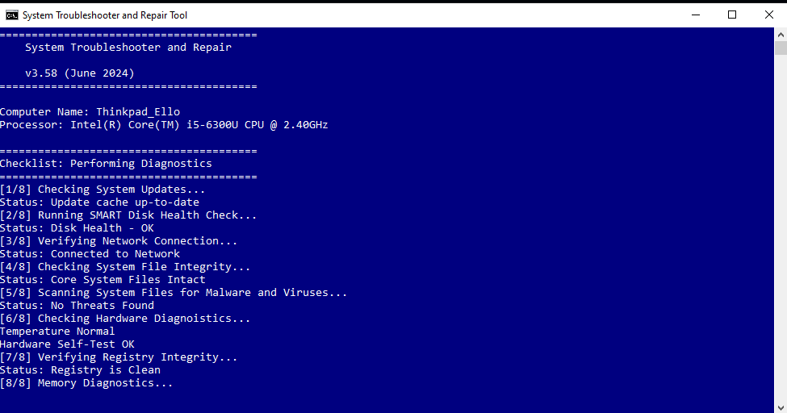

# STRT- Fake System Repair Tool

STRT is a harmless, **placebo-style** script designed to simulate a system repair tool for **system administrators** on end users machines who may need to force a reboot and give the impression that something was fixed. This script is **non-intrusive**, **does not make system changes**, and **poses no risk** to the system.

## Features

- **No System Changes**: The script does not actually fix any issues or modify system settings. It only pretends to fix issues.
- **No Admin Privileges Required**: The script can run without administrator privileges, so it can be used in environments where elevated rights are not available.
- **100% Open Source**: Feel free to modify, redistribute, and use the script as you see fit. It's completely open for customization.
- **Compiling Recommended**: For production environments, it is recommended to compile the script into an `.exe` to protect the code and prevent users from seeing what it really isn't!
- **Simulates Repairs**: The script randomly generates fake "repair" actions, including tasks like scanning the system or fixing registry entries, but it does **NOT** actually perform any system repairs.
- **Scheduled Reboot**: The script forces a restart after a randomized series of checks and simulated repairs, making it look like a real system fix.

## Intended Use

This script is designed primarily for **system administrators** who may need to **simulate** a system repair without actually fixing anything. It is useful in situations where:

- You need to force a reboot but want to provide a placebo effect that something was "fixed."
- You want to simulate a troubleshooting session without making any real changes to the system.
- You need a quick, harmless solution for creating the illusion of system repair in environments where you don’t have admin rights or wish to keep the process simple.

## Limitations

- **No Real Fixes**: This script will **not** resolve any actual issues that would require more than a reboot.
- **No Real Troubleshooting**: It’s just for show and **won't fix anything** a simple reboot wouldn't address.
- **No Underlying Problem Fix**: If the system has actual problems, this script won’t help you fix them.

## How It Works

1. **Loading Banner**: Displays the system's basic information (CPU, RAM, OS) and gives the user the illusion of a professional repair process.
2. **Fake Repairs**: Simulates tasks like scanning, registry fixing, etc.
3. **Randomized Delays**: Adds a sense of realism by waiting between actions with random delays.
4. **Reboot**: After completing the simulated repairs, a scheduled restart is triggered to give the user the impression that the system needs to be resarted to complete the "repair."

## Usage

To get started, simply download or clone the repository and run the batch file in any Windows environment. The script is designed to be simple and easy to run.

1. Clone this repository or download the bat script script.
2. Double click the script (no admin rights required).
3. Watch as the script performs its "repairs" and forces a reboot after a couple of minutes.
4. User is prompted to 'press any key' which prompts the script to close and restart. This schedules a 120 seconds countdown timer.
5. Restart can be stopped by closing the script prior to the script closing or issuiing the 'shutdown -a' command in CMD to abort the shutdown/restart
## License

This project is licensed under the MIT License - feel free to modify and use it as needed.

## Disclaimer
- It is not a replacement for real troubleshooting or system repairs. It is designed solely for **entertainment, simulation, and placebo** purposes.
- **No actual system errors are fixed** — if your system has problems, this script won't solve them!
- No warranty of any kind is implied or included

## Download Script

<a href="https://github.com/squawki/System-Troubleshooter-and-Repair-/releases/download/v3.58_Release/STRT.bat" download>
    <button style="padding: 10px 20px; background-color: #4CAF50; color: white; border: none; cursor: pointer;">
        Download Batch File - Last Updated 09/11/2024
    </button>
</a>
